# 🛍️ E-Commerce Customer Churn Prediction
This project predicts customer churn for an e-commerce platform using behavioral data. It includes exploratory data analysis, model training and tuning, deployment via FastAPI, monitoring with Prometheus and Grafana, and containerization with Docker.

# 📌 Problem Description
Customer churn is a critical issue for e-commerce businesses. Retaining existing customers is often more cost-effective than acquiring new ones. This project uses the [E-Commerce Customer Behavior dataset](https://www.kaggle.com/datasets/shriyashjagtap/e-commerce-customer-for-behavior-analysis?) to build a machine learning model that predicts whether a customer is likely to churn based on their interaction history, preferences, and satisfaction scores.
The solution is designed to help marketing and customer success teams proactively engage at-risk customers and improve retention strategies.

# 💡 Project Background
This repo extends a machine learning notebook into a full MLOps workflow following the Machine Learning Zoomcamp Midterm Project guidelines. It covers:
- Data preparation and EDA
- Training and hyperparameter tuning, selecting the best model
- Experiemtn tracking using MLFlow (additional)
- Serving via FastAPI
- Monitoring using Prometheus and Grafana
- Docker for reproducibility
- (Future work: CI/CD, orchestration, cloud deployment, etc.)

# ⚙️ Tech Stack & Architecture
| Tool                    | Purpose                                |
| ----------------------- | -------------------------------------- |
| Pandas, scikit-learn    | Data handling and modeling             |
| MLflow                  | Experiment tracking and model registry |
| FastAPI, Docker         | Serving and containerization           |
| Prometheus + Grafana    | Monitoring metrics and dashboards      |
| GitHub Actions (future) | CI/CD pipeline                         |

System flow:
`processed_data.csv` → `train.py` (MLflow logs & registered the best model) → `FastAPI app` (serves model) → `Docker + docker-compose` → Prometheus scrapes `/metrics` → Grafana dashboards visualize.

# 📊 Exploratory Data Analysis (EDA)
The EDA includes:
- Missing value checks and imputation strategies
- Standardize data types and values
- Target variable (`Churn`) balance and correlation with predictors
- Univariate, Bivariate, and Multivariate analysis
- Feature importance analysis using mutual information
EDA was performed in Jupyter notebooks.

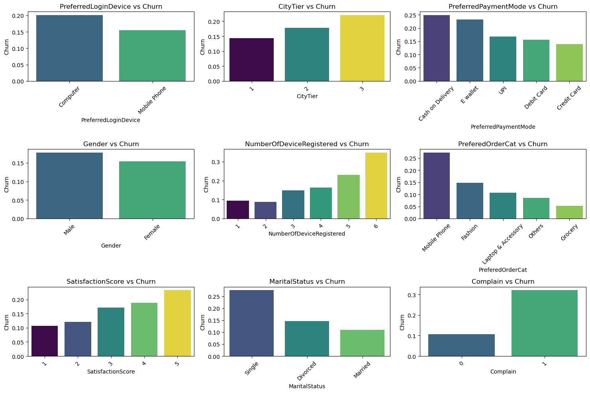
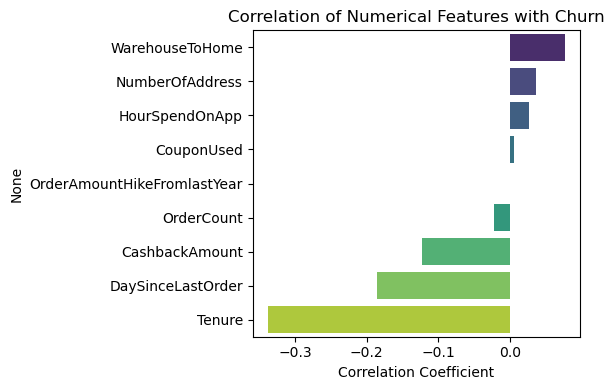

# 🤖 Model Training
Multiple models were trained and evaluated:
- Logistic Regression
- Decision Tree
- Random Forest
Each model was tuned using `GridSearchCV` and cross-validation using `KFold`. The best-performing pipeline was registered in `MLflow` with metrics logged and artifacts stored. Final model selection was based on `F1 score`.

# 🧪 Reproducibility
- Training logic is exported to `train.py`
- Prediction logic is in `predict.py`
- Dataset is publicly available on Kaggle with download instructions in the notebook and README
- Dependencies are listed in `requirements.txt` for precise reproducibility.
- MLflow is used for experiment tracking and model registry
- SQLite backend ensures local reproducibility

# 🚀 Model Deployment
The model is deployed using FastAPI and served via `app.py`. It exposes:
- `/predict` endpoint for real-time predictions
- `/health` endpoint for service status
- `/metrics` endpoint for Prometheus monitoring

# 📈 Monitoring
Prometheus and Grafana are integrated for live monitoring:
- Request count, latency, and response size
- Dashboard panels for operational metrics
- Docker Compose orchestrates all services

# 📦 Dependency and Environment Management
- Dependencies are listed in `requirements.txt` (generated via `pipreqs`)
- Virtual environment managed with `uv` and `pyproject.toml`
- Instructions for setup:
```
uv venv
uv pip install -r requirements.txt
```

# 🐳 Containerization
- Dockerfile provided for building the FastAPI app
- Docker Compose used to run FastAPI, Prometheus, and Grafana together
- Instructions:
```
docker-compose up --build
```

# ☁️ Cloud Deployment

The application is deployed to [Render](https://render.com), a cloud platform for hosting web services. The deployment includes:
- FastAPI backend for serving predictions at `/predict`
- Dockerized services using `uv` and `uvicorn`
- Secure and reproducible deployment via GitHub integration
- Instruction for deployment:
    1. Push your code to GitHub
    2. Create a new **Web Service** on Render
    3. Choose the GitHub repo
    4. Fill in the information (e.g. Name, Language: Docker
    5. Click **Deploy Web Service** button
    6. Once done, go to /docs
 
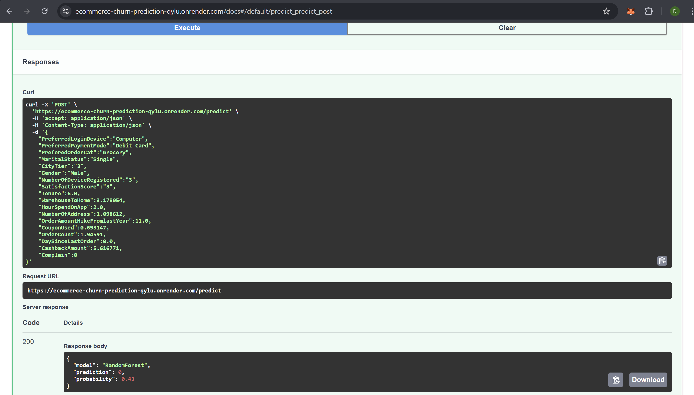

# 🖼️ User Interface
A simple web UI built using **Streamlit** (did not deploy to Render) allows user to:
- Input customer features manually
- View churn prediction and probability
- Instruction to use:
  ```
  streamlit run ui.py
  ```
  Then go to `http://localhost:8501`.

  

  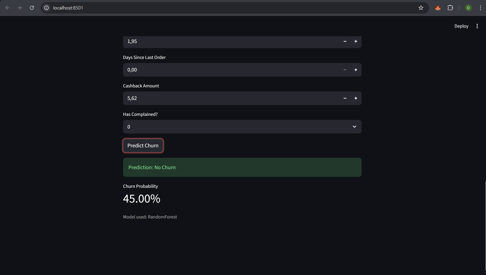
  

A public URL will be added once deployment is finalized.

# 📁 Project Structure
```
.
├── data/
│   ├── e-commerce-dataset.csv          # Raw data
│   └── processed_data.csv              # Cleaned data used for training
├── models/
│   └── best_model.pkl                  # Best model saved
├── notebooks/
│   └── notebook.ipynb                  # EDA and experiments
├── src/              
│   ├── __init__.py
│   ├── dict_vectorizer_transformer.py            
│   ├── preprocess.py                   # Preprocessing
│   ├── train.py                        # Training & MLflow tracking
│   └── predict.py                      # Prediction script
├── app.py                              # FastAPI app
├── Dockerfile                          # Docker image definition
├── docker-compose.yml                  # Orchestration for app + Prometheus + Grafana
├── test.json                           # Test input for inference
├── requirements.txt                    # Project-wide dependencies
├── pyproject.toml                  
└── README.md                           # Project documentation
```

# 🧪 Project Usage Guide
This guide walks you through setting up, training, and running the churn prediction project locally or in Docker.
## 📥 1. Clone the Repository
```
git clone https://github.com/your-username/ecommerce-churn-prediction.git
cd ecommerce-churn-prediction
```

# 📦 2. Install Dependencies
Option A: Using `uv` (recommended)
```
uv venv
uv pip install -r requirements.txt
```

Option B: Using `pip`
```
python -m venv .venv
source .venv/bin/activate  # or .venv\Scripts\activate on Windows
pip install -r requirements.txt
```

# 📁 3. Download the Dataset
Download the dataset from [Kaggle](https://www.kaggle.com/datasets/shriyashjagtap/e-commerce-customer-for-behavior-analysis?) and place it in the `data/` folder:
```
ecommerce-churn-prediction/
└── data/
    └── E Commerce Dataset.csv
```

# 🧠 4. Run EDA (Optional)
Explore the dataset using the notebook:
```
jupyter notebook notebooks/eda.ipynb
```

# 🏋️ 5. Train the Model
```
python -m src.train
```

This will:
- Train multiple models
- Log metrics and artifacts to MLflow
- Register the best model
- Promote it to the "Production" stage

Use MLFLow UI to check MLFlow tracking.
```
mlflow ui --backend-store-uri sqlite:///mlflow.db
```
Go to `http://localhost:5000`, view Experiments, and explore the Model Registry under `ecommerce-churn-model`.

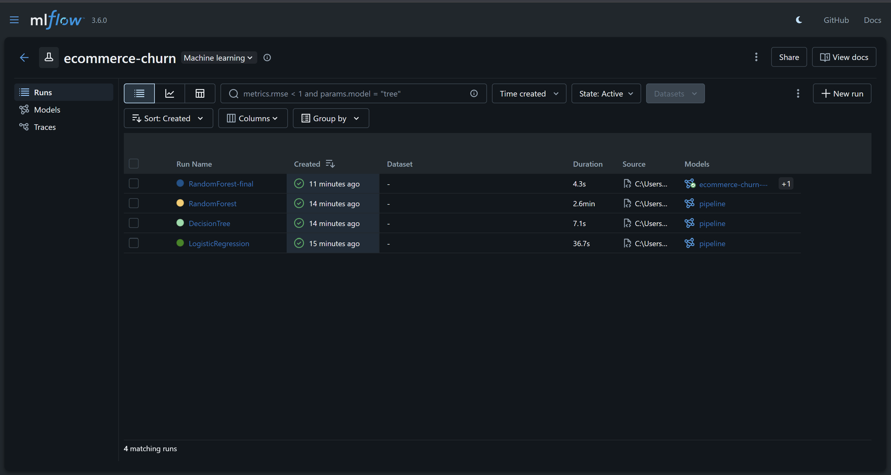

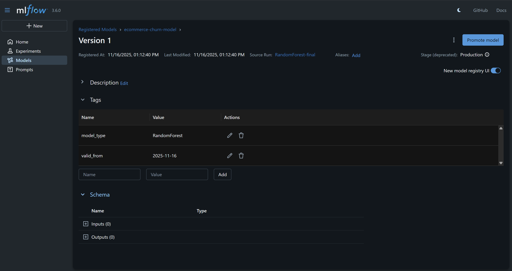

# 🔮 6. Make Predictions
```
python -m src.predict
```

This loads the model from MLflow and runs a sample prediction.

Expected result:
```
{'model': 'ecommerce-churn-model', 'prediction': 0, 'probability': 0.43}
```

# 🚀 7. Run the FastAPI App
```
uvicorn app:app --host 0.0.0.0 --port 9696
```

Endpoints:
- `POST /predict` → Make predictions
- `GET /health` → Check service status
- `GET /metrics` → Prometheus metrics

Visit `http://localhost:8000/docs` for interactive API docs. Send POST requests to `/predict` with features in `test.json`.

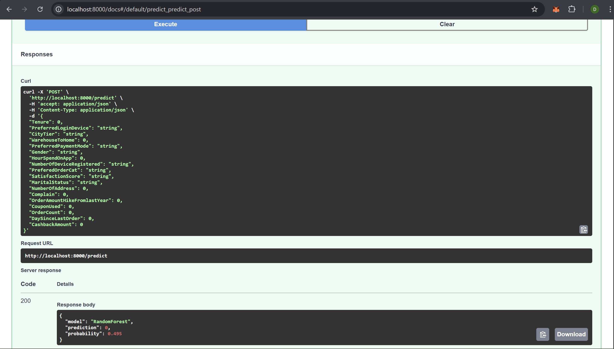

Or do curl on bash:
```
curl -X POST "http://localhost:8000/predict" \
     -H "Content-Type: application/json" \
     -d @./test.json
```

Expected result:
```
{'model': 'RandomForest', 'prediction': 0, 'probability': 0.43}
```

# 🐳 8. Run with Docker
```
docker-compose up --build
```

This launches:
- FastAPI app
- Prometheus
- Grafana dashboard

# 📈 9. Access Monitoring Dashboard
- FastAPI: http://localhost:9696/docs

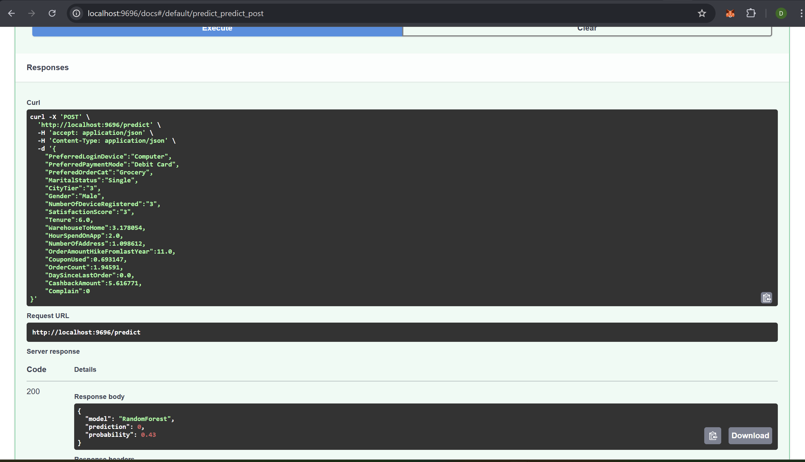

- Prometheus: http://localhost:9090 (try typing query `up` or `http_requests_total`)

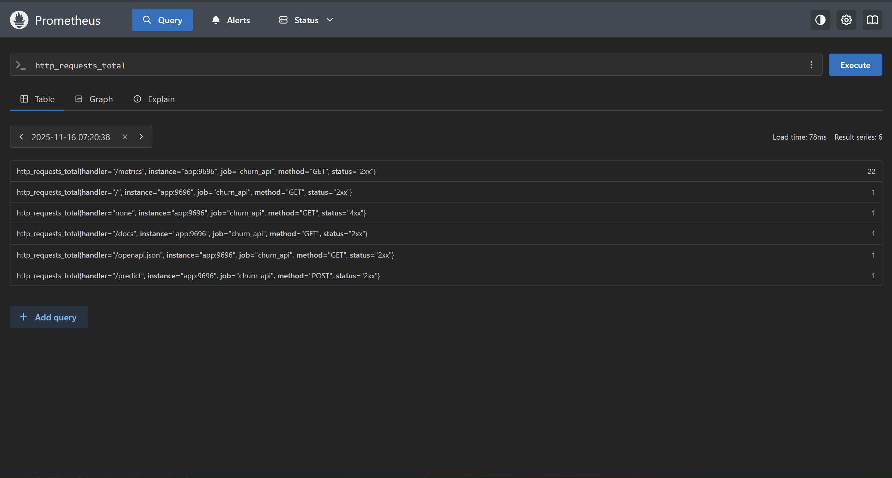

- Grafana: http://localhost:3000
    - Default login: `admin` / `admin`
    - Add new connection: http://prometheus:9090
    - Import dashboard JSON from `fastapi_dashboard.json` or `docker_wsl_dashboard.json`

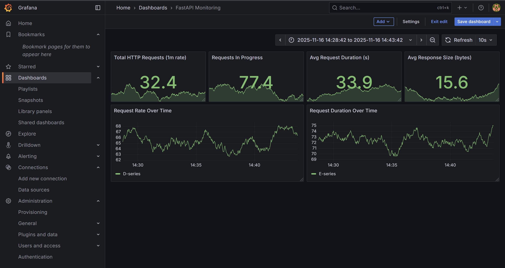

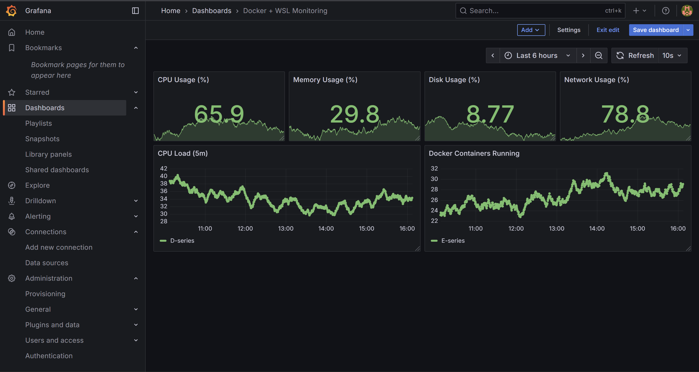

# 🧠 Future Work
- Add Prefect for workflow orchestration
- Deploy to cloud (e.g. AWS, or GCP)
- CI/CD via GitHub Actions (tests, builds)
- Implement drift detection and alerting using Prometheus Alertmanager


